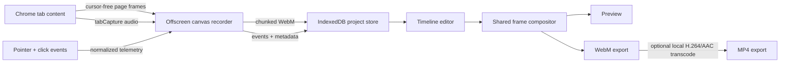

# Open Screen Studio

Open Screen Studio is a local-first Chrome recorder and editor for polished product demos. It records the **website viewport only**—not Chrome's tabs, address bar, bookmarks, or menus—and keeps cursor/click data separate from the raw video so cursor movement, visibility, and camera motion stay editable after recording.

The project is an independent, open-source implementation inspired by the interaction model of [Screen Studio](https://screen.studio/). It is not affiliated with Screen Studio.

## Product model

The reference product is best understood as a recorder plus an opinionated automatic video editor:

- The raw screen image and cursor telemetry are captured separately.
- Cursor samples are resampled and smoothed for deliberate, natural motion.
- Clicks create automatic zoom ranges; manual zooms can be added on the timeline.
- The virtual camera eases between zoom states, follows the pointer with a dead zone, and stays inside the source bounds.
- Cursor size, idle hiding, and visibility remain editable after recording.
- Background, spacing, aspect ratio, corner radius, shadow, and export settings are project-level choices.

Official reference material used for this specification:

- [Screen Studio product overview](https://screen.studio/)
- [Automatic zoom behavior](https://screen.studio/guide/auto-zoom)
- [Adding and editing zooms](https://screen.studio/guide/adding-editing-zooms)
- [Cursor controls](https://screen.studio/guide/cursor)
- [Animation controls](https://screen.studio/guide/animations)
- [Cropping recordings](https://screen.studio/guide/cropping-the-recording)
- [Export settings](https://screen.studio/guide/explanation-of-export-settings)

## Scope

The first complete release covers the requested core workflow:

1. Focus any normal `http://` or `https://` Chrome tab.
2. Click the extension action and wait for the three-second countdown.
3. Interact with the website while the tab content and pointer telemetry are recorded.
4. Click the action again to stop and open the editor.
5. Preview or adjust automatic/manual zooms, cursor smoothing/size, follow behavior, framing, and trim points.
6. Add one or more timeline ranges where the cursor should be hidden; drag or resize those ranges after recording.
7. Export the composited result as a fast WebM or broadly compatible MP4 video.

Intentionally out of scope: webcam/talking-head bubbles, cloud sharing, accounts, transcription, microphone enhancement, and system-wide desktop capture.

## Why a Chrome extension

An operating-system window recording includes Chrome's toolbar. Open Screen Studio instead records page frames from Chrome's [`Page.startScreencast`](https://chromedevtools.github.io/devtools-protocol/tot/Page/#method-startScreencast) protocol and sends them to an [offscreen document](https://developer.chrome.com/docs/extensions/how-to/web-platform/screen-capture). Those frames contain the website viewport, not Chrome's tabs or address bar. Chrome's [`tabCapture`](https://developer.chrome.com/docs/extensions/reference/api/tabCapture) stream is retained only for the tab's audio.

A content script records normalized pointer/click samples at the same time. The live native pointer remains visible and unchanged for the person recording, but Chrome's page frames omit that operating-system cursor. The editor draws a high-resolution synthetic cursor later. This is what makes smoothing, resizing, click effects, idle hiding, scrolling without a cursor glyph, and section-level cursor hiding possible without changing the raw pixels.



## Project data

Projects are non-destructive. The extension stores these pieces locally:

```text
raw WebM recording
timestamped normalized cursor/click/viewport events
trim bounds
automatic and manual zoom ranges
cursor-hidden timeline ranges
cursor, camera, frame, and export settings
```

Preview and export use the same pure frame calculations so the saved result matches the editor. Recording chunks are written to IndexedDB while recording instead of being retained as one growing in-memory buffer.

## Quick start

Requirements: Chrome 118+ and Node.js 20.19+.

```bash
npm install
npm run build
```

Then:

1. Open `chrome://extensions`.
2. Enable **Developer mode**.
3. Choose **Load unpacked** and select this repository's `dist` directory.
4. Pin **Open Screen Studio**.
5. Focus the website tab you want to record and click the extension icon.
6. Click the icon again to stop.

All recording and editing data stays in the extension's local browser storage. No server, login, or network upload is used.

## Development commands

```bash
npm run dev        # rebuild the extension when source files change
npm run build      # type-check and create dist/
npm run typecheck  # TypeScript only
npm test           # unit and component tests
npm run test:watch
```

After a development rebuild, press **Reload** on the extension card in `chrome://extensions`. Reloading the extension while a capture is active ends that capture.

## Expected limitations

- Chrome internal pages, the Chrome Web Store, browser permission prompts, browser autocomplete popovers, and DRM-protected video cannot be captured or instrumented.
- Chrome shows its standard debugging banner while page-frame capture is active. DevTools or another debugger cannot be attached to the recorded tab at the same time.
- Page frames are damage-driven and recorded at up to 30 fps. A 60 fps export remains available, but it cannot invent source motion that Chrome did not deliver.
- The initial build targets the top-level page. Pointer tracking inside deeply nested cross-origin iframes may be incomplete.
- Every export is composited in real time through Chrome's native `MediaRecorder`. WebM downloads immediately after that render; MP4 then runs through the bundled single-thread ffmpeg.wasm encoder locally, so it takes longer and uses more memory.
- Closing the recorded tab ends its media stream. Navigation is supported on ordinary pages, but unusual page security policies can affect telemetry reinjection.
- Very long recordings depend on available browser storage and disk quota.

## Privacy and permissions

The extension requests debugger-based page-frame capture, tab audio capture, offscreen recording, downloads, local storage, and page-script access on normal web URLs. The debugger connection is attached only during an active recording and is used only for page screencast frames; it does not evaluate page JavaScript or inspect network traffic. Page access collects pointer/click/viewport/scroll events. The extension does not collect keystroke contents, form values, cookies, page source, or browsing history, and it does not alter the live browser cursor.

## Status

Version 0.1 implements the full local record → edit → export workflow. The
production extension has been validated in Chrome with a real tab capture,
pointer/click telemetry, generated auto zoom, persisted cursor-hidden range,
project reopen, and local WebM/MP4 export. Acceptance criteria are tracked
in [PLAN.md](./PLAN.md).

Open Screen Studio's own source is released under the [MIT License](./LICENSE).
The optional bundled MP4 encoder remains under its upstream licenses, including
GPL-2.0-or-later for `@ffmpeg/core`; see
[THIRD_PARTY_NOTICES.md](./THIRD_PARTY_NOTICES.md).
